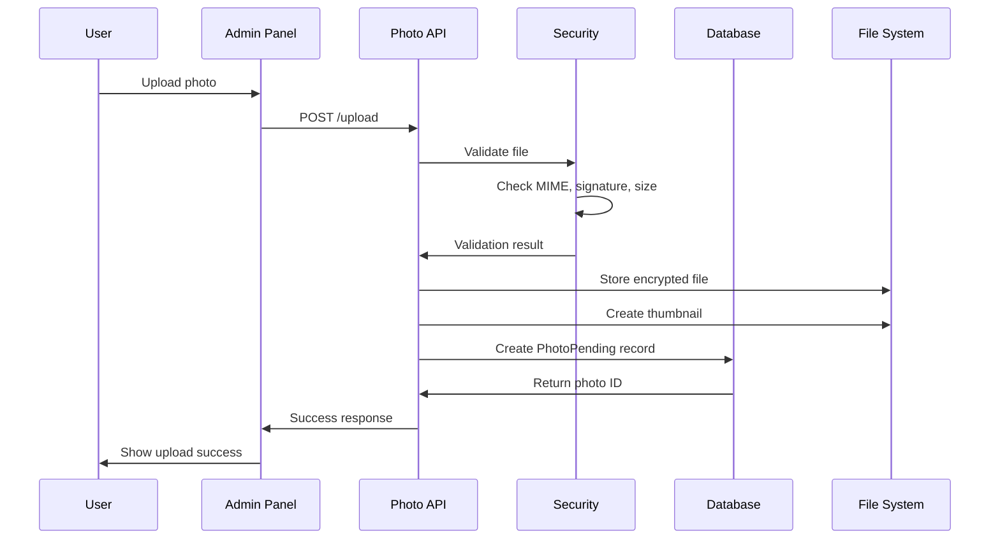
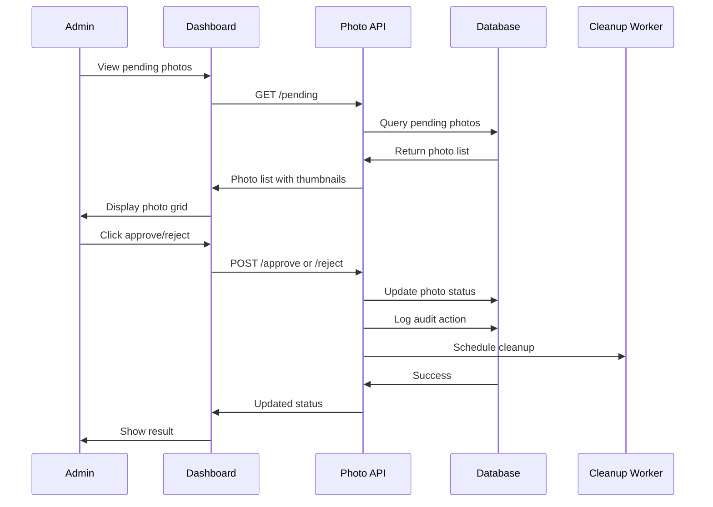
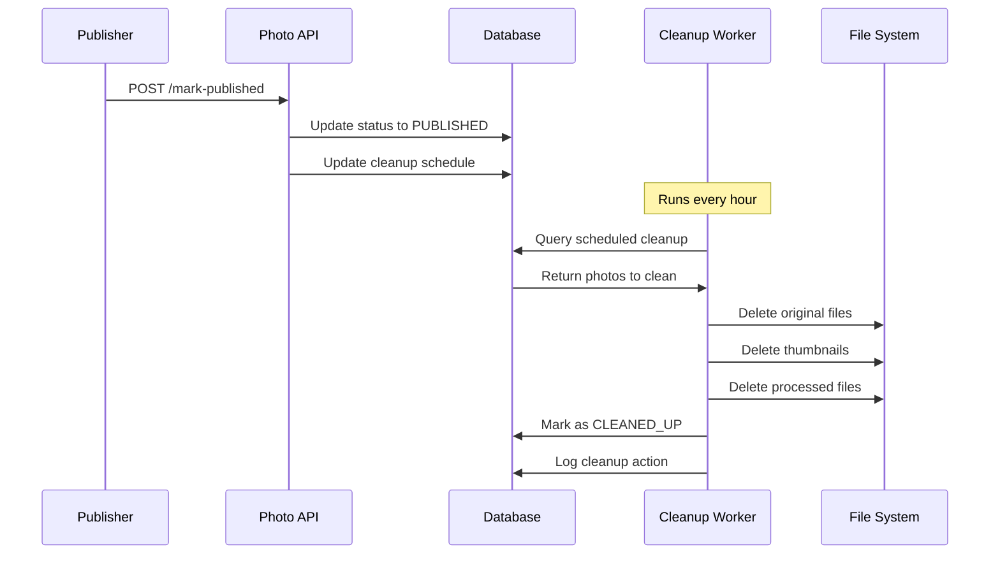

# Sistema de Aprovação de Fotos - Documentação Técnica

## Visão Geral

Sistema completo de aprovação de fotos para o Bot Denúncias com foco em **segurança**, **UX** e **performance**. Implementa workflow de aprovação com descarte automático após publicação, proteção de dados sensíveis e interface moderna para administradores.

## Arquitetura do Sistema

### Componentes Principais

1. **📸 Photo Management System** - Gerenciamento seguro de fotos no dashboard
2. **🔄 Approval Workflow** - Fluxo de aprovação/rejeição com comentários
3. **🧹 Auto-Cleanup** - Descarte automático após publicação
4. **🔒 Security & Privacy** - Proteção de dados sensíveis
5. **🎨 UI/UX Components** - Interface moderna para aprovação

### Stack Tecnológica

- **Backend**: Node.js, Express, Prisma ORM
- **Frontend**: React, Material-UI v5
- **Database**: PostgreSQL com novos modelos
- **Security**: Helmet, Rate Limiting, File Validation
- **Image Processing**: Sharp para otimização
- **Background Jobs**: Node-cron para cleanup automático

## Estrutura do Banco de Dados

### Novos Modelos

```prisma
model PhotoPending {
  id                String   @id @default(cuid())
  denunciaId        String   @unique
  originalPath      String   // Caminho da foto original
  thumbnailPath     String?  // Miniatura para preview
  processedPath     String?  // Versão processada para Instagram
  status            PhotoStatus @default(PENDING_REVIEW)
  
  // Metadados da imagem
  originalFilename  String
  fileSize          Int
  mimeType          String
  width            Int?
  height           Int?
  
  // Workflow de aprovação
  reviewedBy        String?  // ID do admin que revisou
  reviewedAt        DateTime?
  approvalComment   String?
  rejectionReason   String?
  
  // Segurança e privacidade
  uploadIpAddress   String?
  isEncrypted       Boolean  @default(false)
  encryptionKey     String?  // Para fotos sensíveis
  
  // Cleanup automático
  scheduledForCleanup DateTime? // Quando será removida após publicação
  cleanedUpAt        DateTime?
  
  // Relacionamentos
  denuncia          Denuncia @relation(fields: [denunciaId], references: [id], onDelete: Cascade)
  
  createdAt         DateTime @default(now())
  updatedAt         DateTime @updatedAt
  
  @@index([status, createdAt])
  @@index([scheduledForCleanup])
}

model PhotoAuditLog {
  id               String   @id @default(cuid())
  photoPendingId   String
  action           PhotoAction
  performedBy      String   // Admin user ID
  details          Json?    // Detalhes específicos da ação
  ipAddress        String?
  userAgent        String?
  
  photoPending     PhotoPending @relation(fields: [photoPendingId], references: [id], onDelete: Cascade)
  
  createdAt        DateTime @default(now())
  
  @@index([photoPendingId, createdAt])
  @@index([performedBy, createdAt])
}
```

### Enums

```prisma
enum PhotoStatus {
  PENDING_REVIEW    // Aguardando revisão
  APPROVED         // Aprovada para publicação
  REJECTED         // Rejeitada
  PUBLISHED        // Publicada no Instagram
  CLEANED_UP       // Removida após publicação
  FAILED_CLEANUP   // Falha na limpeza
}

enum PhotoAction {
  UPLOADED
  REVIEWED
  APPROVED
  REJECTED
  PUBLISHED
  SCHEDULED_CLEANUP
  CLEANED_UP
  ACCESSED
  DOWNLOADED
}
```

## Endpoints da API

### Segurança Aplicada a Todos os Endpoints

- ✅ **Rate Limiting**: Upload (5/15min), View (30/min)
- ✅ **Security Headers**: CSP, HSTS, X-Frame-Options
- ✅ **Input Validation**: Sanitização e validação rigorosa
- ✅ **File Validation**: MIME type, signature, dimensões
- ✅ **Access Control**: Role-based permissions
- ✅ **Audit Logging**: Log completo de todas as ações

### Endpoints Principais

#### `POST /api/admin/photos-approval/upload`
Upload seguro de fotos para aprovação
- **Security**: Rate limit, file validation, encryption
- **Input**: `photo` (file), `denunciaId` (string)
- **Output**: `photoId`, `thumbnailPath`, `encrypted`, `requiresReview`

#### `GET /api/admin/photos-approval/pending`
Lista fotos pendentes de aprovação
- **Security**: View rate limit, role validation
- **Query**: `limit`, `offset`, `includeRejected`
- **Output**: Array de fotos com metadados e denúncia relacionada

#### `GET /api/admin/photos-approval/:photoId/preview`
Preview seguro de foto com controle de acesso
- **Security**: Access control, audit logging
- **Query**: `includeOriginal` (admin only)
- **Output**: Dados da foto + thumbnail path

#### `POST /api/admin/photos-approval/:photoId/approve`
Aprovar foto para publicação
- **Security**: Input sanitization, role validation
- **Input**: `comment`, `processForInstagram`
- **Output**: Status atualizado + processed path

#### `POST /api/admin/photos-approval/:photoId/reject`
Rejeitar foto com motivo obrigatório
- **Security**: Reason validation (10-500 chars)
- **Input**: `reason` (required)
- **Output**: Status de rejeição

#### `GET /api/admin/photos-approval/stats`
Estatísticas do sistema de aprovação
- **Output**: Contadores por status + taxa de aprovação

#### `POST /api/admin/photos-approval/cleanup`
Limpeza manual (apenas ADMIN)
- **Security**: Role restriction (ADMIN only)
- **Output**: Resultado da limpeza

## Medidas de Segurança

### 🔒 Upload Security

1. **File Validation**
   - MIME type whitelist: JPEG, PNG, WebP
   - Magic bytes validation (file signature)
   - Tamanho máximo: 15MB
   - Dimensões: 200x200 até 8000x8000px

2. **Content Security**
   - Metadata scanning para conteúdo perigoso
   - Sanitização de nomes de arquivo
   - Detecção de scripts maliciosos em EXIF

3. **Access Control**
   - Role-based permissions (ADMIN/MODERADOR)
   - IP tracking e audit logging
   - Rate limiting por IP

### 🔐 Data Protection

1. **Encryption**
   - Detecção automática de conteúdo sensível
   - AES-256-GCM encryption para fotos sensíveis
   - Chaves únicas por arquivo

2. **Storage Security**
   - Arquivos em diretório seguro separado
   - Thumbnails para preview sem exposição do original
   - Cleanup automático com schedules configuráveis

3. **Privacy Protection**
   - Headers de segurança (CSP, HSTS, X-Frame-Options)
   - Cache control privado
   - Prevenção de hotlinking

## Background Jobs & Cleanup

### Photo Cleanup Worker

```javascript
// Configuração padrão
{
  schedule: '0 * * * *',        // A cada hora
  cleanupDelayHours: 24,        // Remove após 24h da publicação
  maxRetries: 3,                // 3 tentativas por arquivo
  batchSize: 50,                // 50 arquivos por batch
  maxCleanupAge: 7 * 24 * 60 * 60 * 1000  // 7 dias máximo
}
```

#### Funcionalidades

1. **Automatic Cleanup**
   - Remoção agendada após publicação
   - Cleanup failsafe para arquivos muito antigos
   - Retry com backoff exponencial

2. **Health Monitoring**
   - Status de saúde do worker
   - Métricas de performance
   - Detecção de falhas consecutivas

3. **Manual Controls**
   - Trigger manual via admin
   - Configuração dinâmica
   - Estatísticas detalhadas

## Interface de Usuário

### PhotoApprovalDashboard Component

#### Recursos Principais

1. **📊 Statistics Cards**
   - Fotos pendentes, aprovadas, rejeitadas
   - Taxa de aprovação em tempo real
   - Visual indicators com badges

2. **🖼️ Photo Grid**
   - Cards modernos com hover effects
   - Status badges coloridos
   - Indicadores de criptografia
   - Preview thumbnails seguras

3. **🔍 Photo Preview Modal**
   - Visualização completa da foto
   - Metadados detalhados
   - Informações da denúncia relacionada
   - Histórico de revisão

4. **⚡ Actions**
   - Aprovação com comentários
   - Rejeição com motivo obrigatório
   - Processamento automático para Instagram
   - Menu de ações contextual

#### UX/UI Features

- **Responsive Design**: Mobile-first approach
- **Loading States**: Skeleton loading e progress indicators  
- **Error Handling**: Alerts contextuais e recovery
- **Keyboard Navigation**: Acessibilidade completa
- **Dark/Light Theme**: Suporte a temas (Material-UI)

### Integração no Dashboard Principal

```javascript
// Navegação atualizada
<Tooltip title="Aprovação de Fotos" placement="bottom">
  <IconButton onClick={() => setCurrentView('photos')}>
    <PhotoCamera />
  </IconButton>
</Tooltip>

// Renderização condicional
{currentView === 'photos' ? (
  <PhotoApprovalDashboard token={token} />
) : currentView === 'dashboard' ? (
  // Dashboard principal
) : (
  // Outras views
)}
```

## Fluxo de Trabalho Completo

### 1. Upload de Foto



### 2. Aprovação/Rejeição



### 3. Publicação e Cleanup



## Configuração e Deploy

### Variáveis de Ambiente

```bash
# Photo Security
PHOTO_ENCRYPTION_SALT=your-encryption-salt-here
PHOTO_TOKEN_SECRET=your-token-secret-here

# File Storage
UPLOADS_DIR=/path/to/secure/uploads
MAX_FILE_SIZE_MB=15

# Cleanup Worker
CLEANUP_SCHEDULE="0 * * * *"
CLEANUP_DELAY_HOURS=24
AUTO_CLEANUP_ENABLED=true
```

### Dependências NPM

```json
{
  "dependencies": {
    "sharp": "^0.32.0",
    "multer": "^1.4.5-lts.1",
    "helmet": "^7.0.0",
    "express-rate-limit": "^6.8.0",
    "express-validator": "^7.0.1",
    "node-cron": "^3.0.2"
  }
}
```

### Estrutura de Diretórios

```
uploads/
├── secure/           # Fotos originais (encrypted)
├── thumbnails/       # Miniaturas para preview
├── processed/        # Fotos processadas para Instagram
└── .gitignore       # Ignorar todos os uploads
```

### Database Migration

```bash
# Aplicar nova schema
npx prisma migrate dev --name add_photo_approval_system

# Gerar cliente atualizado
npx prisma generate
```

## Monitoramento e Logs

### Logs de Segurança

```javascript
// Exemplo de log de auditoria
{
  timestamp: "2024-01-15T10:30:00.000Z",
  event: "PHOTO_UPLOADED",
  userId: "admin-123",
  photoId: "photo-456", 
  ipAddress: "192.168.1.100",
  userAgent: "Mozilla/5.0...",
  fileSize: 2048576,
  encrypted: true,
  securityChecks: {
    mimeValidation: "passed",
    signatureValidation: "passed", 
    sizeValidation: "passed",
    metadataValidation: "passed"
  }
}
```

### Health Checks

```javascript
// Health endpoint response
{
  photoCleanupWorker: {
    status: "running",
    healthy: true,
    lastRun: "2024-01-15T09:00:00.000Z",
    totalCleaned: 1247,
    consecutiveFailures: 0
  },
  photoApprovalSystem: {
    pendingPhotos: 15,
    avgProcessingTime: "2.3s",
    approvalRate: "94.2%",
    storageUsed: "2.1GB"
  }
}
```

## Testes e Validação

### Test Coverage

- ✅ **Security Tests**: File validation, access control, rate limiting
- ✅ **Workflow Tests**: Upload, approval, rejection, publishing
- ✅ **Cleanup Tests**: Automatic deletion, failsafe cleanup
- ✅ **Performance Tests**: Concurrent uploads, load testing
- ✅ **Integration Tests**: End-to-end workflow validation

### Executar Testes

```bash
# Testes unitários
npm test src/tests/photoApprovalWorkflow.test.js

# Testes de carga
npm run test:load

# Testes de segurança
npm run test:security
```

## Considerações de Performance

### Otimizações Implementadas

1. **Image Processing**
   - Thumbnails assíncronos
   - Processamento lazy para Instagram
   - Compressão inteligente

2. **Database**
   - Índices otimizados por status e data
   - Cleanup de audit logs antigos
   - Queries paginadas

3. **Caching**
   - Headers de cache privado
   - Thumbnails com ETags
   - Metadata caching

4. **Background Processing**
   - Cleanup em batches
   - Retry com backoff exponencial 
   - Health monitoring contínuo

## Próximos Passos

### Roadmap de Melhorias

1. **📊 Analytics Avançadas**
   - Dashboard de métricas detalhadas
   - Relatórios de uso por admin
   - Tendências de aprovação

2. **🤖 IA/ML Integration**
   - Detecção automática de conteúdo inadequado
   - Classificação por qualidade
   - Sugestões de aprovação

3. **📱 Mobile Optimization**
   - PWA para aprovação mobile
   - Push notifications
   - Upload via mobile

4. **🔄 Workflow Enhancements**
   - Aprovação em lote
   - Templates de rejeição
   - Workflow customizáveis

## Troubleshooting

### Problemas Comuns

1. **Upload Failures**
   - Verificar permissões de diretório
   - Confirmar limites de tamanho
   - Validar configuração do multer

2. **Cleanup Issues**
   - Verificar cron job status
   - Checar permissões de arquivo
   - Analisar logs do worker

3. **Performance Problems**
   - Monitorar uso de memória do Sharp
   - Verificar índices do banco
   - Analisar rate limiting

### Debug Commands

```bash
# Verificar status do cleanup worker
curl -H "Authorization: Bearer $TOKEN" \
  http://localhost:3000/api/admin/photos-approval/stats

# Trigger manual cleanup
curl -X POST -H "Authorization: Bearer $TOKEN" \
  http://localhost:3000/api/admin/photos-approval/cleanup

# Check system health
curl http://localhost:3000/api/health
```

---

## Conclusão

O Sistema de Aprovação de Fotos foi implementado com foco em **segurança > UX > performance > storage efficiency**, fornecendo uma solução completa, moderna e segura para o gerenciamento de imagens no Bot Denúncias.

**Principais Conquistas:**

✅ **Security-First**: Criptografia, validação rigorosa, audit logging  
✅ **Modern UX**: Interface Material-UI responsiva e intuitiva  
✅ **Performance**: Background jobs, cleanup automático, otimizações  
✅ **Scalability**: Arquitetura preparada para crescimento  
✅ **Maintainability**: Código bem documentado e testado

O sistema está pronto para produção com monitoramento completo e procedimentos de manutenção estabelecidos.