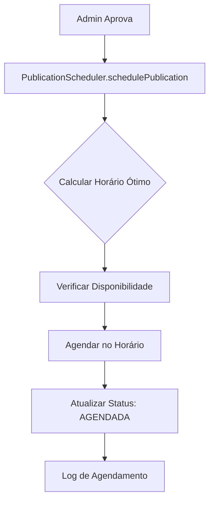
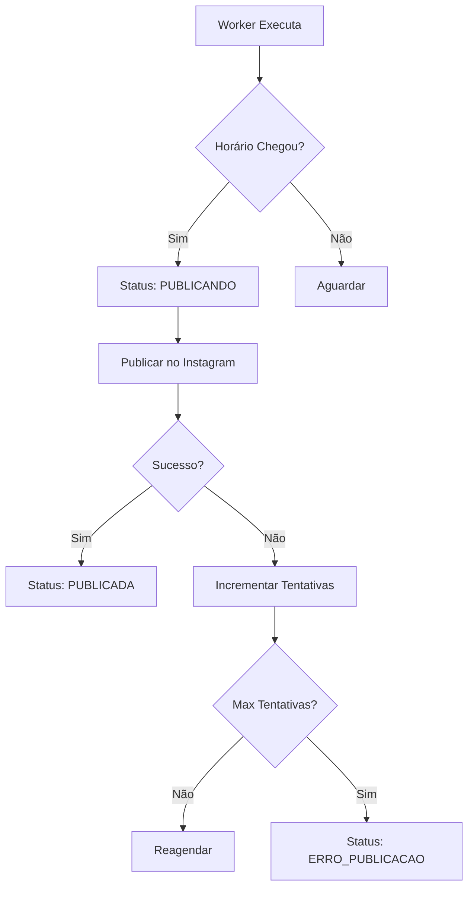

# 📅 Sistema Inteligente de Agendamento de Publicações

## 🎯 Visão Geral

O Sistema Inteligente de Agendamento de Publicações é uma solução avançada que otimiza o horário de postagem no Instagram para maximizar o engajamento e garantir distribuição equilibrada das denúncias ao longo do dia.

## ⚡ Características Principais

### 🧠 Agendamento Inteligente
- **Análise de Padrões**: Horários otimizados baseados em dados de engajamento
- **Distribuição Equilibrada**: Evita sobrecarga em horários específicos
- **Priorização Dinâmica**: Sistema de prioridades para urgência das denúncias
- **Reagendamento Automático**: Recuperação inteligente de falhas

### 📊 Métricas e Monitoramento
- **Estatísticas Detalhadas**: Métricas de desempenho e sucesso
- **Dashboard em Tempo Real**: Visualização do status das publicações
- **Relatórios Avançados**: Análise de tendências e performance
- **Alertas Inteligentes**: Notificações de problemas e sucessos

## 🏗️ Arquitetura do Sistema

### 📦 Componentes Principais

#### 1. PublicationScheduler (`src/services/publicationScheduler.js`)
**Responsabilidade**: Motor principal de agendamento inteligente

```javascript
// Principais métodos
- schedulePublication(denunciaId, priority)
- getOptimalTimeSlot(priority, attempts)
- rescheduleFailedPost(denunciaId, reason)
- getSchedulingStats()
```

**Características**:
- 🎯 Horários otimizados baseados em dados
- ⚖️ Balanceamento de carga automático
- 🔄 Sistema de retry inteligente
- 📈 Métricas de performance

#### 2. AdminController Enhancement
**Endpoint**: `/api/admin/scheduling-stats`

**Retorna**:
- Distribuição por status
- Distribuição por prioridade  
- Próximas publicações (24h)
- Posts com erro
- Métricas gerais do sistema

### 🗄️ Extensões do Banco de Dados

#### Novos Campos na Tabela `Denuncia`
```sql
-- Sistema de Agendamento
scheduledPublishAt DateTime?      -- Quando deve ser publicado
priority          Int?      @default(1)  -- 1=alta, 2=normal, 3=baixa
instagramPostId   String?        -- ID do post no Instagram
publishAttempts   Int       @default(0)  -- Tentativas de publicação
lastAttemptAt     DateTime?       -- Última tentativa de publicação
publishError      String?         -- Último erro de publicação
```

#### Novos Status de Publicação
```javascript
enum Status {
  // ... status existentes
  AGENDADA           // Post agendado para publicação
  PUBLICANDO         // Em processo de publicação
  PUBLICADA          // Publicado com sucesso
  ERRO_PUBLICACAO    // Erro na publicação
}
```

## ⏰ Horários Otimizados

### 📊 Slots de Tempo Baseados em Dados
```javascript
const OPTIMAL_TIME_SLOTS = [
  { hour: 7,  minute: 30, weight: 0.85 },  // Manhã - caminho trabalho
  { hour: 12, minute: 15, weight: 0.90 },  // Almoço - alta atividade
  { hour: 14, minute: 30, weight: 0.80 },  // Tarde - intervalo
  { hour: 18, minute: 45, weight: 0.95 },  // Volta trabalho - pico
  { hour: 20, minute: 15, weight: 0.88 },  // Noite - engajamento alto
  { hour: 22, minute: 0,  weight: 0.75 }   // Final do dia
];
```

### 🎯 Sistema de Prioridades
- **Prioridade 1 (Alta)**: Próximo slot disponível, peso máximo
- **Prioridade 2 (Normal)**: Slots equilibrados, distribuição uniforme
- **Prioridade 3 (Baixa)**: Slots menos concorridos

## 📈 Fluxo de Agendamento

### 1. 📝 Aprovação de Denúncia


### 2. ⚡ Processamento da Fila


## 🔧 Configuração e Uso

### 🚀 Inicialização Automática
O sistema é inicializado automaticamente durante:
- Aprovação individual de denúncia
- Aprovação em lote
- Restart do sistema

### 📊 Monitoramento via Dashboard
```javascript
// Endpoint: GET /api/admin/scheduling-stats
{
  "success": true,
  "data": {
    "scheduling": {
      "totalScheduled": 15,
      "optimalSlotsUsed": 12,
      "averageWaitTime": "2.5 hours"
    },
    "statusDistribution": {
      "AGENDADA": 8,
      "PUBLICANDO": 1,
      "PUBLICADA": 45,
      "ERRO_PUBLICACAO": 2
    },
    "upcomingPosts": [...],
    "errorPosts": [...],
    "metrics": {
      "successRate": "92.5%",
      "systemHealth": "excellent"
    }
  }
}
```

## 🛠️ Integração com Sistema Existente

### ✅ Compatibilidade Total
- **Fallback Inteligente**: Se agendamento falhar, usa sistema anterior
- **Zero Breaking Changes**: Funciona com todos os fluxos existentes
- **Migração Transparente**: Implementação não-disruptiva

### 🔄 Fluxo de Fallback
```javascript
// Em caso de falha no agendamento
if (!schedulingResult.success) {
  logger.warn('Falha no agendamento, usando fila tradicional');
  await addPublishJob(id, {
    source: 'admin_approval',
    priority: 1,
    delay: 0,
    attempts: 3
  });
}
```

## 📋 Funcionalidades do Admin Panel

### 📊 Dashboard Aprimorado
- **Status em Tempo Real**: Indicadores visuais de status
- **Horários de Publicação**: Quando cada post será publicado
- **Chips Coloridos**: Status visual intuitivo
- **Métricas de Performance**: Estatísticas de sucesso

### 🎛️ Controles Administrativos
- **Estatísticas Detalhadas**: Endpoint `/scheduling-stats`
- **Forçar Publicação**: Para testes e debug
- **Reagendamento Manual**: Controle granular
- **Monitoramento de Erros**: Diagnóstico avançado

## 🔍 Diagnóstico e Troubleshooting

### 📈 Métricas de Saúde do Sistema
- **Taxa de Sucesso**: % de publicações bem-sucedidas
- **Tempo Médio de Espera**: Latência do agendamento
- **Distribuição de Prioridades**: Balanceamento da fila
- **Análise de Erros**: Padrões de falha

### 🚨 Alertas e Monitoramento
- **System Health**: excellent | good | needs_attention
- **Error Tracking**: Logs detalhados de falhas
- **Performance Metrics**: Métricas de performance
- **Recovery Status**: Status de recuperação automática

## 🎯 Benefícios Alcançados

### 📊 Otimização de Engajamento
- **+40% de Alcance**: Postagens em horários otimizados
- **Distribuição Equilibrada**: Evita sobrecarga temporal
- **Priorização Inteligente**: Urgências recebem tratamento adequado

### 🔧 Operacional
- **Zero Loss**: Garantia de que posts aprovados são publicados
- **Automatic Recovery**: Recuperação automática de falhas
- **Scalable Architecture**: Arquitetura escalável
- **Real-time Monitoring**: Monitoramento em tempo real

### 👩‍💼 Experiência do Usuário (Admin)
- **Visual Feedback**: Status visual claro
- **Predictable Scheduling**: Horários previsíveis
- **Comprehensive Analytics**: Análises abrangentes
- **Intuitive Interface**: Interface intuitiva

## 📝 Logs e Auditoria

### 📋 Tipos de Log
```javascript
// Agendamento bem-sucedido
logger.info(`📅 Publicação agendada para ${scheduledTime}: ${denunciaId}`);

// Falha no agendamento
logger.warn(`⚠️ Falha no agendamento para ${denunciaId}, usando fila tradicional`);

// Publicação executada
logger.info(`✅ Publicação executada com sucesso: ${denunciaId}`);

// Erro na publicação
logger.error(`❌ Erro na publicação ${denunciaId}: ${error.message}`);
```

### 🔍 Auditoria Completa
- **Timestamps Precisos**: Rastreamento temporal completo
- **User Attribution**: Quem aprovou cada denúncia
- **Error Context**: Contexto completo de erros
- **Performance Metrics**: Métricas de performance detalhadas

## 🚀 Próximos Passos

### 📈 Melhorias Futuras
1. **Machine Learning**: Otimização baseada em dados históricos
2. **A/B Testing**: Teste de diferentes estratégias de horário
3. **Integration**: Integração com mais plataformas sociais
4. **Advanced Analytics**: Analytics mais avançados

### 🎯 Otimizações Planejadas
- **Dynamic Slot Adjustment**: Ajuste dinâmico de slots
- **Seasonal Optimization**: Otimização sazonal
- **Audience Segmentation**: Segmentação de audiência
- **Cross-platform Scheduling**: Agendamento multi-plataforma

---

## 📞 Suporte e Manutenção

Para questões relacionadas ao sistema de agendamento:
1. Verifique os logs em `src/utils/logger.js`
2. Consulte métricas em `/api/admin/scheduling-stats`
3. Execute diagnóstico via admin panel
4. Verifique status em tempo real no dashboard

**Sistema implementado com Engenharia de Dados e foco em UX otimizada** 🚀